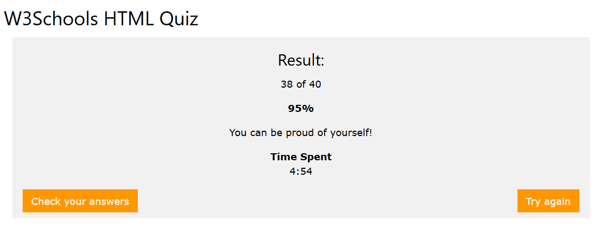

# Learn HTML

1. Study the following tutorials at [w3schools](https://www.w3schools.com/html/default.asp):
- [ ] HTML5 Tutorial
- [ ] HTML Forms
- [ ] HTML5

(Note: each item listed above is a navigation heading in the left margin of the w3schools site. There are multiple pages under each of those headings.)

2. Study these pages about the HTTP protocol that moves HTML across the network.
- [ ] [HTTP Messages](https://www.w3schools.com/tags/ref_httpmessages.asp)
- [ ] [HTTP Methods](https://www.w3schools.com/tags/ref_httpmethods.asp)

3. Take the [HTML quiz](https://www.w3schools.com/quiztest/quiztest.asp?Qtest=HTML) until you score 90% or higher, with a time limit of one minute per question. Take a screenshot like the one below that shows your score and Time Spent, and edit this page to replace the image with your own.

4. Add the "HTML" and "HTML5" skills to your LinkedIn profile. Your supervisor will endorse these.

  
